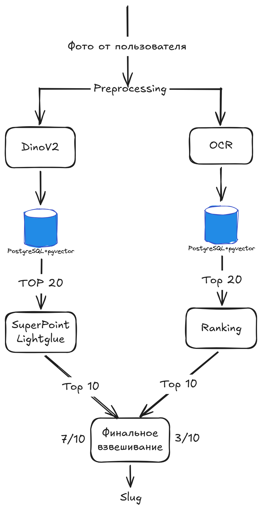

# Чек-лист формы сдачи

Замените все значения `ДОБАВИТЬ` и проверьте ссылки в режиме инкогнито.

## Поля формы

**Репозиторий:** <https://github.com/Woolfer0097/SvoeVinO>

**Документация:**
<https://github.com/Woolfer0097/SvoeVinO/blob/main/docs/PROJECT_DOCUMENTATION.md>

**Презентация:** `https://docs.google.com/presentation/d/1pzhzqwI5W76UL3ebhlab9h3O8Sioo7neJVBXNWMWcOU/edit?usp=sharing`

**Прототип:** `https://wine.knittta.ru/`

**Swagger:** `https://wine.knittta.ru/docs`

**Дополнительные материалы:**

- runtime-архив БД и эталонных фото: [скачать ZIP](https://wine.knittta.ru/downloads/svoevino-runtime-giant-e5-20260929-final.zip);
- файл: `svoevino-runtime-giant-e5-20260929-final.zip` (352 415 229 байт);
- SHA-256 архива: `0de7dd968d28955af082ec41770e724110c7ab76d1038be844b37099c3800dbc`;
- [файл контрольной суммы](https://wine.knittta.ru/downloads/svoevino-runtime-giant-e5-20260929-final.zip.sha256);
- видеодемонстрация: `ДОБАВИТЬ ПУБЛИЧНУЮ ССЫЛКУ`;
- схема архитектуры:

## Финальная проверка

- [ ] Репозиторий публичный, актуальная версия находится в `main`.
- [ ] В Git и его истории нет `.env`, паролей, токенов и cookies.
- [ ] Все ссылки открываются без входа и запроса прав.
- [ ] Runtime-архив скачивается без авторизации и имеет SHA-256.
- [ ] Чистый клон запускается строго по корневому README.
- [ ] Открываются frontend, `/docs` и `/openapi.json`.
- [ ] `POST /v1/eval/predict` возвращает непустой slug в лимит времени.
- [ ] Проверены JPEG, PNG/WebP, повреждённый и слишком большой файл.
- [ ] В архиве нет feedback-фото без согласия пользователей.
- [ ] Стенд использует HTTPS, уникальный пароль БД и firewall.
- [ ] Презентация и видео доступны без входа в аккаунт.

Публичного исходного кода недостаточно: каталог и эталонные фото игнорируются
Git. Runtime собран локально в `artifacts/` и опубликован через Caddy по ссылке
выше, без авторизации. Отдельный read-only каталог и точный список двух
разрешённых URL не открывают доступ к рабочей БД, feedback-фото и секретам.
Архив распаковывается в `modules/dinov2_retrieval/data/`; инструкции и CPU-only
override входят в него. Веса и образы скачиваются при первом запуске.
Локальный `.env.cloud` публиковать нельзя.
